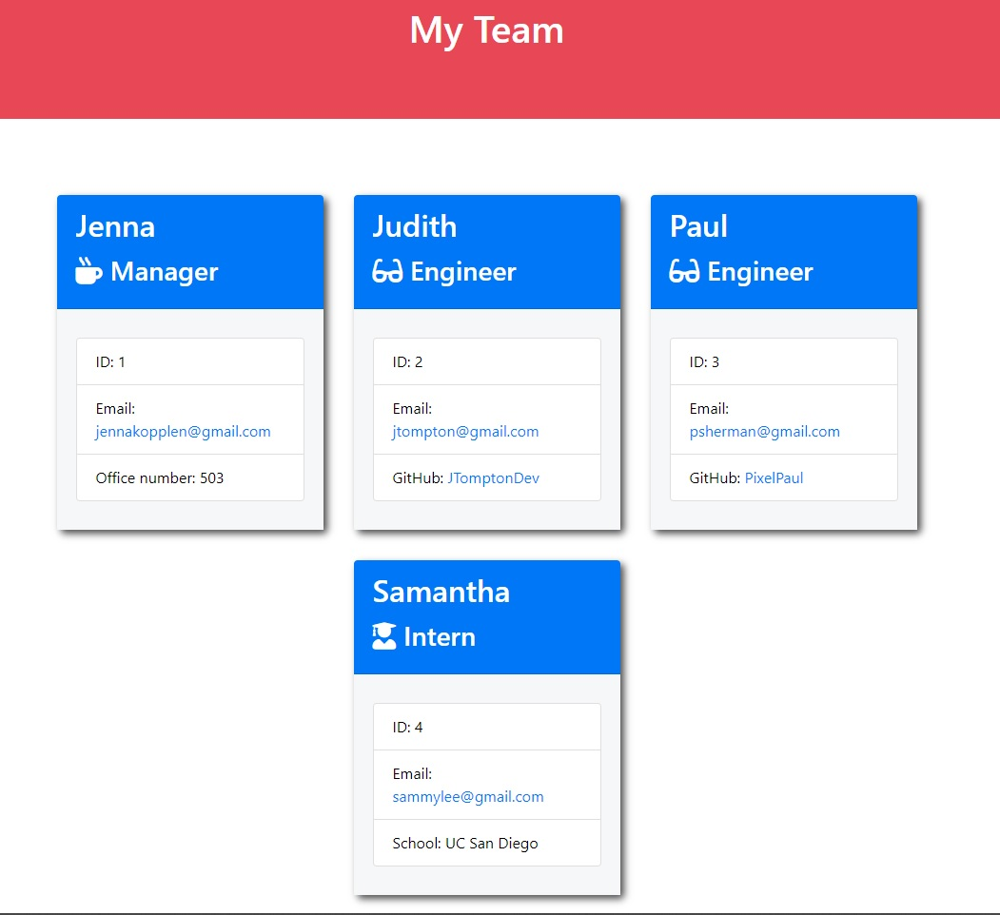

# Team Profile Generator

Github App Repository Page: https://github.com/anzelcapparelli/teamProfileGen

## Table of contents

- [Description](#Descriptionn)
- [Installation](#Installation)
- [Usage](#Usage)
- [Testing](#Testing)
- [License](#License)
- [Questions?](#Questions?)

## Description

This app generates a html page of all team members, of which it collects the information for this via terminal inputs. The app will continue to accept new team members until selecting "I'm done".

## Installation

after downloading the files off GitHub, run:

`npm i`

in the terminal to download the modules necessary for this app to run. If any issues with installation, make sure both 'inquirer' and 'util' are successfully downloaded from npmjs.com

## Usage

in preferred terminal, run:

`node index.js`

Then answer the prompts that appear in the terminal. The 'arrow keys' navigate, and the 'spacebar' selects a choice on the select-one questions.

Animated Demonstration:

## Testing

Using the command:

`npm run test`

which currently only tests the viability of the object Constructor modules. More tests to come to test the app itself (auto input in the app file, assessing that a page which matches the info is generated).

## License

This project is licensed under the MIT licensing.

## Questions?

If you have any questions or comments, please contact me using one or more of the following:

Github Profile: [https://github.com/anzelcapparelli](https://github.com/anzelcapparelli)

Email: anzelcapparelli@gmail.com
